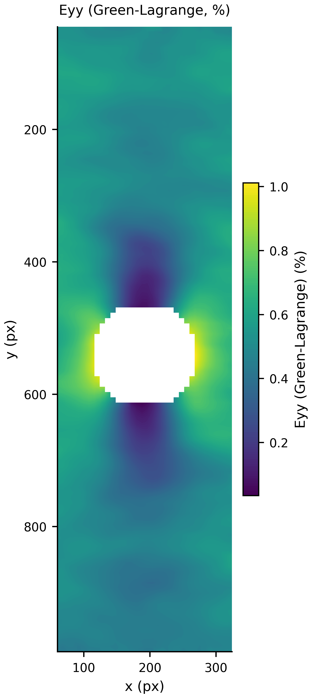

# 2D DIC 工作流与验证（2026-10-07）

本次改进覆盖相关求解、亚像素插值、位移异常处理、应变拟合、试样遮罩、连续云图和数值导出。主要瓶颈是原亚像素采样的周期误差、应变导数对位移噪声的放大，以及背景和孔洞混入子集。单独改变颜色或增加平滑不能解决这些问题。

当前方法仍是固定参考帧、局部子集、一阶仿射变换的面内 2D DIC。公开实验图像和独立合成图像已用于验证；没有同条件 VIC-2D 结果或独立实验应变真值，因此不宣称商业软件精度等效，也不把拟合残差解释为实验测量不确定度。

## 从图像到科研结果

1. 载入尺寸一致的序列，选择参考帧与分析范围。相关计算采用参考帧固定的浮点灰度缩放，保留高位深图像中小于一个显示灰度级的变化；显示图单独转为 8 bit。
2. 在参考图绘制全场 ROI。对孔洞、夹具、标签和背景导入同尺寸黑白遮罩，或拖出排除矩形。白色保留、黑色排除。“自动纹理”按局部纹理生成候选遮罩，必须预览检查，不能代替几何识别。若按文件夹载入序列，应把遮罩放在图像序列文件夹外，避免当成变形帧；CLI 可明确列出 `image_paths`。
3. 设置子集大小、步长和应变窗口。子集必须完整落在参考试样遮罩中，孔洞和边缘附近会留下约半个子集宽度的未测区域。最小预检仍要求 3×3 POI 网格，遮罩后至少九个可计算 POI；少量孤立点可能没有足够邻点计算应变。
4. 使用 IC-GN，必要时选择 IC-LM 或多尺度求解。默认自动尝试 SIFT/RANSAC 仿射初值，只有匹配数量、内点比例、重投影误差和变换条件通过检查才使用；其作用仅是初始化。桌面默认开启“仅接受收敛子集”，每个子集仍须通过相关峰、ZNCC、条件数与收敛检查。CLI/core 保留兼容的非严格默认，科研配置应显式设置 `quality.reject_nonconverged=true`。特征初值失败后回退局部初值，不能保证恢复任意大运动或重复纹理。
5. 保持额外高斯平滑为零，从较小应变窗口开始。桌面默认七个 POI，兼容的 CLI/core 默认五个；`strain_window_px` 是历史配置名称，实际单位为 **POI 个数**。稳健局部拟合默认开启，最高二阶，缺少可靠曲率时采用一阶。窗口内只使用与中心连通的有效点。
6. 检查相关有效率、应变有效率、无效原因、局部拟合残差、有效支撑点数和实际拟合阶数。默认科学覆盖门槛仍为相关有效率 0.95、应变有效率 0.80，分母只包含遮罩允许的子集。输出完成与 `scientific_ok` 是不同状态；部分有效帧可以保留用于诊断，但不得据此宣称整场有效。
7. 在“分析结果”切换分量，展开“显示设置”选择底图、色标、百分数和测量点/连续云图。多帧定量比较应使用相同手动色标与相同单位。导出当前图可保存 PNG/PDF；序列自动保存全部数值、分量图、参数和运行清单。

## 改进的计算方法

| 环节 | 当前实现及其作用 |
| --- | --- |
| 亚像素相关 | 每帧/尺度缓存五阶 B 样条系数，采用四阶差分参考梯度；归一化 ZNSSD 雅可比消除均值和对比度变化。GN 线搜索和 LM 均检查实际残差下降；停止判据使用未阻尼的位移等效增量。IC 方向停滞时，按当前目标图的归一化雅可比作前向加法细化，继续验证下降与收敛，不能把阻尼造成的小步长当作收敛。越界变换不以反射像素作为测量。 |
| 大运动初值 | 经验证的特征仿射初值提供全局位置；细部搜索限制在重投影误差支持的邻域，减少跳到远处重复纹理峰。初值、内点数量和实际搜索范围均记录。 |
| 位移异常 | 留一局部二阶预测识别孤立失配，阈值同时受用户像素下限和局部稳健残差控制；`outlier_threshold_px=0` 关闭空间拒绝。处理后无效点保持 NaN，拒绝前候选保留在 `u_raw/v_raw`。边界或邻点不足时不强行判为异常。 |
| 位移到应变 | 缩放局部坐标后进行一阶/二阶最小二乘与 Tukey 稳健重加权，记录支撑数、有效权重、阶数、残差和条件数；不跨越窗口内不连通的裂缝。可选高斯预处理也限制在连通邻域，且不填补缺失中心。 |
| 云图 | 有效四角单元内进行分片线性三角形插值与连续等值填色，不跨 NaN、遮罩孔洞或翻折单元，不外推、不修改 POI 数值。色标默认包含完整有限值范围，无隐藏百分位裁剪；支持零点对称和手动范围。ZNCC 默认使用 0–1。 |

`u/v/x/y` 的单位是 px。`Exx/Eyy/Exy` 是 Green–Lagrange 应变，`exx/eyy/exy` 是无穷小应变，均无量纲；`Exy/exy` 是张量剪切分量，小应变工程剪切为 `2*exy`。图像坐标 x 向右、y 向下。叠加参考图时使用参考坐标，叠加变形图时使用 `X+u,Y+v`；在变形坐标中绘图不会改变应变的定义。

## 数值验证与噪声取舍

独立验证直接在连续随机 Fourier 纹理上计算平移、仿射和二次位移的逆变换，没有用求解器插值器制造目标图。参考版本为提交 `2736691`，核心文件 SHA-256 为 `c48d289020cf28f7ec0ae262dddb83caa6df67f937f7c1fbcdb99b774f9179e6`。子集 25 px、步长 8 px、额外平滑为零；全部测试场的相关和应变覆盖率为 100%。原始报告见 [机器可读验证记录](validation/dic_research_20261007.json)。

| 测试量 | 原实现，窗口 5 | 当前实现，窗口 5 | 当前实现，窗口 7 |
| --- | ---: | ---: | ---: |
| 17 个亚像素平移位置，位移 RMSE / px | 0.0370597 | 0.00000255 | 0.00000255 |
| 整场平移，位移 RMSE / px | 0.0376273 | 0.0000323 | 0.0000323 |
| 仿射场，位移 RMSE / px | 0.0320565 | 0.0000310 | 0.0000310 |
| 仿射场，Exx RMSE | 0.00137439 | 0.000000649 | 0.000000272 |
| 二次位移场，Exx RMSE | 0.00135717 | 0.000120191 | 0.000084461 |
| 独立灰度噪声 σ=1.5，位移 RMSE / px | 0.0345757 | 0.00681742 | 0.00681742 |
| 同一带噪声场，Exx RMSE | 0.000269302 | **0.000296492** | 0.000169801 |

相同五点窗口下，带噪声应变 RMSE 略有增加。七点窗口使 POI 支撑跨度由 32 px 增加到 48 px，才使该测试中的应变噪声进一步降低；不能把这部分改善归因于亚像素求解本身。满窗口的图像支撑还包含子集宽度：本例约为 57 px 与 73 px。实验应根据最小待识别结构选择窗口，并比较多个窗口下的峰值、位置和幅值变化。

理想平滑纹理的微小误差只是插值/求解回归证据，不是相机标定后的实验精度。单独的应变拟合测试还检查了二次场边界偏差、缺失裂缝、孤立失配、刚体转动的零 Green–Lagrange 应变，以及宽度为 12 POI 的高斯应变峰在七点窗口下保留超过 98% 峰值；后者不是任意局部应变峰的系统分辨率保证。提高精度增加了计算成本，本次不宣称速度提升。

复现独立测试：

```powershell
py -3.11 benchmarks/research_validation.py --strain-window 5 --output outputs/analytic-window5.json
py -3.11 benchmarks/research_validation.py --strain-window 7 --output outputs/analytic-window7.json
```

可用 `--core-file` 指向从上述提交保存的旧核心进行匹配比较。脚本记录核心 SHA-256、参数、覆盖率、偏差、99% 误差和运行时间。

## 公开实验图像

使用 [Ncorr 官方 sample12 带孔板数据](https://ncorr.com/download/sample12.zip)，ZIP SHA-256 为 `4590f83a688bfa5a2c72168e9e93ec536a868fac7897db5a664b2b7f6fdc1a76`。参考 `ohtcfrp_00.tif`，目标 04 和 08，ROI `(45,30,302,975)`，子集 31 px、步长 8 px、窗口 5、ZNCC 下限 0.85，使用提供的 `roi.tif`。

| 目标图 | 相同保留子集域的原位移拟合残差中位数 / px | 当前残差 / px | 遮罩允许的相关 / 应变覆盖率 |
| --- | ---: | ---: | ---: |
| ohtcfrp_04 | 0.00565741 | 0.00138073 | 100% / 100% |
| ohtcfrp_08 | 0.00516676 | 0.00139902 | 100% / 100% |

比较使用同一 3784 个保留 POI，旧位移先排除当前遮罩不允许的子集再重新计算旧应变拟合。当前两帧的 3784 个保留子集均收敛，验证开启严格收敛拒绝。262 个遮罩排除点不计入覆盖分母。残差降低约四倍是局部拟合一致性的改善，不能替代独立应变真值。孔边保留真实未测区域，连续色图没有跨孔洞填色。



复现（先从官方链接下载并解压，不修改原图）：

```powershell
py -3.11 benchmarks/validate_plate_hole.py --images C:/data/sample12 --output outputs/plate-hole
```

另检查了 [py2DIC 的 LabTest GFRP 天然纹理](https://github.com/Geod-Geom/py2DIC/tree/master/LabTest)。使用原图 x=2600–3820 的裁剪区域、ROI `(350,40,820,3330)`，排除导线/标签区域 `(0,1540,1000,500)`，子集 81 px、步长 48 px、七点应变窗口、ZNCC 下限 0.85、最多 40 次迭代并开启严格收敛。特征初值恢复约 58/170 px 的运动，但图 50/100 的相关覆盖率仅约 24.9%/19.8%，应变覆盖率为 17.4%/13.3%，**未达到默认科学覆盖门槛**。两帧均没有接受未收敛子集。未通过区域保持空白，不能为获得完整云图而放宽门槛或补值。实验应改善散斑、成像或帧间运动。没有把无法可靠对齐照片时间的应变计记录当作真值。

## 保存与追溯

每个有效目标帧自动导出 TXT/CSV、九个分量图（u、v、ZNCC、六个应变）、参数 TXT 和无需 pickle 的 NPZ。原十二列顺序保持不变；其后包括原始候选位移、遮罩允许状态、异常标志、相关与应变有效性及拟合诊断。NPZ 保存原始 POI 数组、处理后数组、遮罩和 JSON 元数据，不能把云图像素当作实测值。

运行清单记录配置、图像与遮罩文件 SHA-256、处理遮罩摘要、环境、代码、输出与科学状态。导入遮罩在运行和验收时与图像一样接受内容校验；输出仍遵循暂存、整轮提交和历史结果保留机制。可用 `straintrace verify-manifest --manifest 输出目录/run_manifest.json` 只读复核。

锁定工程基准升级为 `ezdic-benchmark-report-v6` / `ezdic-benchmark-cases-v4`，采用独立解析目标图，位移 RMSE/P95/最大误差门槛收紧为 0.001/0.002/0.005 px，仿射应变与一致性误差门槛为 0.0001。跨环境浮点 CSV 不再与历史字节摘要强制相等，而是校验本次报告所记录的 CSV 内容摘要，并继续检查源代码/输入身份与有容差的数值基线。质量分数仍为 **NOT_CALIBRATED**；通过回归门槛不构成实验标定。

## 开源方法调研与采用边界

- [Ncorr 算法说明](https://ncorr.com/index.php/dic-algorithms)：参考高阶 B 样条、IC-GN 和局部应变拟合；采用独立实现，并明确应变窗口的噪声与分辨率关系。
- [OpenCorr 源码与示例](https://github.com/vincentjzy/OpenCorr)：参考缓存参考梯度/插值系数、收敛检查和特征仿射初值的设计。没有复制其 MPL 代码；本项目保持现有架构与许可证。
- [DICe 虚拟应变计后处理](https://dicengine.github.io/dice/class_d_i_ce_1_1_v_s_g___strain___post___processor.html)：借鉴基于邻域位移最小二乘导数的思路，补充支撑、残差和条件数诊断。
- [py2DIC](https://github.com/Geod-Geom/py2DIC)：比较模板相关与后处理路径，并使用其公开天然纹理数据检查失败边界；没有采用无约束平滑获得连续结果。
- [µDIC 文档](https://mudic.readthedocs.io/en/latest/)：借鉴虚拟实验中单独控制纹理、形变和噪声的验证方法。全局有限元 DIC 未引入当前局部子集架构。
- [SciPy B 样条预滤波](https://docs.scipy.org/doc/scipy-1.17.0/reference/generated/scipy.ndimage.spline_filter.html)：用于插值系数缓存；运行依赖与 Windows 打包均已包含 SciPy。

当前不提供立体/3D DIC、出平面运动修正、自动裂纹拓扑跟踪、全局有限元 DIC或实验不确定度标定。强烈局部非仿射形变、失焦、照明饱和、运动模糊和重复纹理仍需要实验处理与逐帧质量检查。

为兼容 Windows 不区分大小写的文件系统，Green–Lagrange 图使用 `Exx/Eyy/Exy` 文件名，无穷小应变图使用 `exx_infinitesimal/eyy_infinitesimal/exy_infinitesimal`，保证九个分量图各自独立。CSV 与 NPZ 中的分量名称保持不变。
