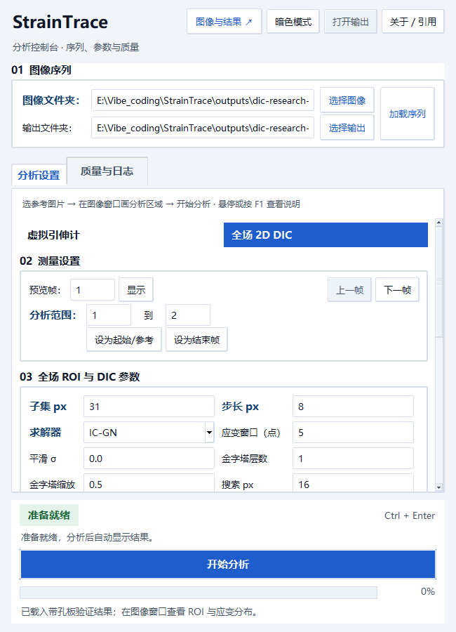
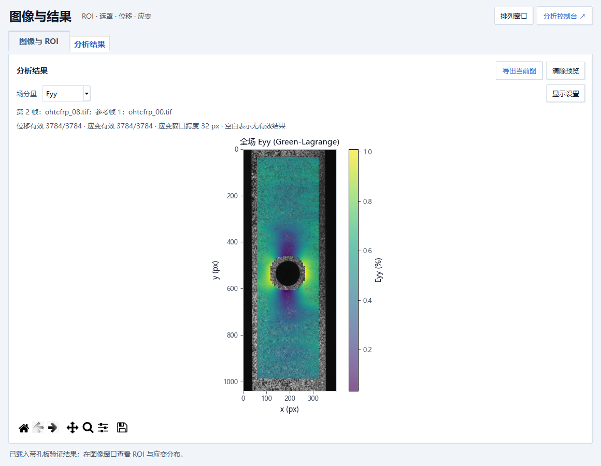

# 桌面工作区

StrainTrace 提供虚拟引伸计和固定参考帧全场 2D DIC 两种分析模式。新版界面沿用现有 Tk 桌面组件，拆分为两个独立窗口：**分析控制台**负责序列、参数、质量与运行；**图像与结果**负责图像、ROI、遮罩、曲线与全场云图。两个窗口可以独立移动、调整大小或放到不同屏幕，缩放图像窗口不会挤压参数区。

关闭“图像与结果”只收起窗口，不清空 ROI 或结果，也不停止正在进行的分析。控制台顶部“图像与结果”或 Ctrl + I 可重新打开；绘制 ROI 和完成分析时也会自动打开。图像窗口的“分析控制台”可返回参数设置，“排列窗口”恢复屏幕内排列。退出控制台时关闭整个程序。

本文截图使用合成散斑图像，展示软件交互和结果呈现。截图中的应变来自合成仿射变形，不代表实验精度或实验不确定度。

## 1. 加载图像并确定参考帧

在顶部选择图像文件夹和输出文件夹，点击“加载序列”。“图像与 ROI”显示当前文件名、帧号、图像尺寸和参考帧；控制台设置预览帧与分析范围。

点击“设为起始/参考”可将当前预览帧设为分析起点。全场模式中，后续变形帧始终与这个固定参考帧比较。更换图像序列后，应重新检查分析范围并定义 ROI。

“适应窗口”将图像完整显示在可用区域；“1:1”以原始像素比例显示。放大后的图像可通过水平、垂直滚动条查看。ROI 坐标始终对应原图像素，图像外的留白不接受 ROI 起点。

## 2. 定义测量区域

**虚拟引伸计：**选择应变方向与追踪模式，在参考帧绘制 ROI 1、ROI 2，点击“添加 ROI 组”。组表优先显示名称、角色、应变方向和初始标距；其他列可水平滚动查看。选中组后可载入、重命名、调整角色或删除。泊松比需要同时定义轴向和横向 ROI 组。

**全场 2D DIC：**选择全场模式，在参考帧绘制矩形 ROI，设置子集尺寸、步长、求解器和应变窗口。全场参数与虚拟引伸计参数独立；全场模式使用固定的 2D 导出内容。

常用参数默认可见；像素标定和详细追踪参数通过“高级设置”展开。窄控制台中，参数区可以滚动，开始分析和处理状态保持可见。

图像窗口保留独立的缩放、平移和绘制工具，放大或缩小窗口不会改变原图 ROI 坐标。

## 3. 检查条件并开始分析

控制台底部始终显示当前是否具备分析条件，并提示下一步操作。缺少图像、ROI 或必要导出选项时，开始按钮禁用；有质量提示时，可在“质量与日志”查看具体原因。提示不等于分析失败，应根据其内容判断图像纹理与参数是否适用。

开始分析后，图像路径、模式和参数暂时禁用，避免界面设置与正在执行的分析不一致。进度条显示百分比；处理完成后恢复操作并切换到“分析结果”。发生错误时显示失败状态及原因，允许修正后重试。

## 4. 查看结果及质量

虚拟引伸计结果显示工程应变，满足角色条件时可切换泊松比。坐标轴明确帧号和无量纲应变；无效帧保持曲线断点，并使用单独标记表示。

全场结果可选择位移、应变或相关系数分量。位移以 px 表示，应变与相关系数无量纲。位移及应变可选连续色标、零点对称或手动范围，相关系数默认使用 0–1。连续云图仅在有效单元内进行分片线性插值，原始测量点数值保留；孔洞、遮罩和无效点不补值。相关有效点和应变有效点分别计数；结果标题下方保留实际分析帧和参考帧的文件信息。

结果图支持平移、缩放、复位和导出，并随窗口尺寸调整。浅色与深色主题同时应用于坐标轴、图例、色标和工具栏。切换主题保留当前结果分量或曲线模式。

上图使用 [Ncorr 官方 sample12](https://ncorr.com/download/sample12.zip)，计算设置和数值验证见 [2D DIC 工作流与验证](2D_DIC_VALIDATION.md)。

控制台“质量与日志”保留质量概览，并分为可滚动的“运行前检查”和“运行日志”，避免窄窗口中的内容相互挤压。全场概览给出有效变形帧数、各帧最低相关有效比例和应变有效比例，并列出失败帧。日志可选取、复制，内容只读。

## 悬停提示与键盘帮助

将鼠标停在按钮、输入框、选项、表格列标题或图表工具栏上片刻，即可查看用途、操作方法和操作结果。使用键盘时，先用 Tab 移到控件，再按 F1 查看说明；按 Esc 关闭提示。提示在离开控件或点击操作时自动收起。

下拉框会解释当前值；展开后，将鼠标移到某一项，或用上下方向键移动，会显示这一项的说明。点击或按回车才会确认选择。结果图的显示设置会说明需要立即更新还是点击“应用”；禁用按钮会说明需要先加载图片、画框或选中分组等条件。

提示中的专业名称直接解释其作用。例如 ROI 是在图上画出的测量区域，帧是序列中的一张图片，ZNCC 表示两个图片块的纹理相似程度，NaN 表示没有有效数值。输入提示包含单位或填写示例；需要调节大小的参数会说明数值改变后的影响。

## 快捷键

| 操作 | 快捷键 |
| --- | --- |
| 查看当前控件说明 / 关闭说明 | F1 / Esc |
| 打开图像与结果窗口 | Ctrl + I |
| 开始分析 | Ctrl + Enter |
| 适应窗口 | Ctrl + F |
| 放大 / 缩小图像 | Ctrl + 加号 / 减号 |
| 加载 / 刷新图像序列 | Ctrl + L |
| 清除当前 ROI（需确认） | Esc |

## 验证范围

本次界面优化在 Windows 原生 Tk 窗口中运行检查，覆盖两种模式的实际后台分析、结果导出与清单校验、ROI 坐标转换、处理状态、失败重试、主题切换及独立的窄控制台和图像窗口。自动化检查覆盖 Tk 缩放系数 1.333、1.666 和 2.5，并检查坐标轴、色标与工具栏是否位于可见画布范围内。

界面检查使用合成图像与公开带孔板图像；数值、导出事务和元数据契约由现有回归检查覆盖。运行检查不会把软件验证解释为实验测量准确度。版本和 DOI 元数据沿用当前项目记录。

另检查了独立调整窗口大小、关闭后保留 ROI 和结果、重新打开、隐藏图像窗口期间完成后台分析，以及细长试样的居中绘图与色标高度。

提示检查遍历初始界面、曲线结果和全场结果中的实际交互控件，核对每个下拉选项都有说明，并检查悬停与 F1、禁用原因、表格列标题、右键菜单、图表工具栏、浅深色配色、屏幕边缘位置，以及控件销毁后的提示清理。
