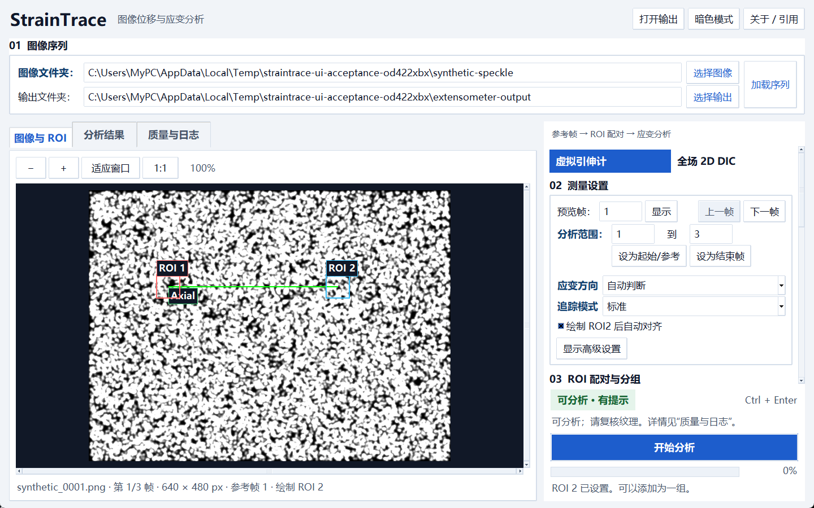
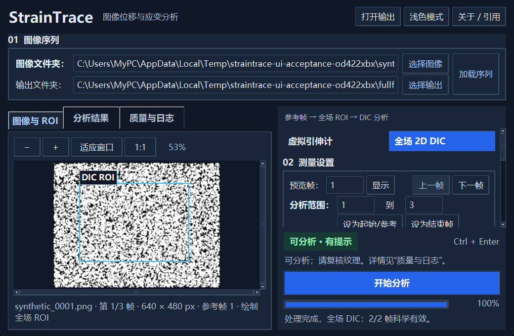
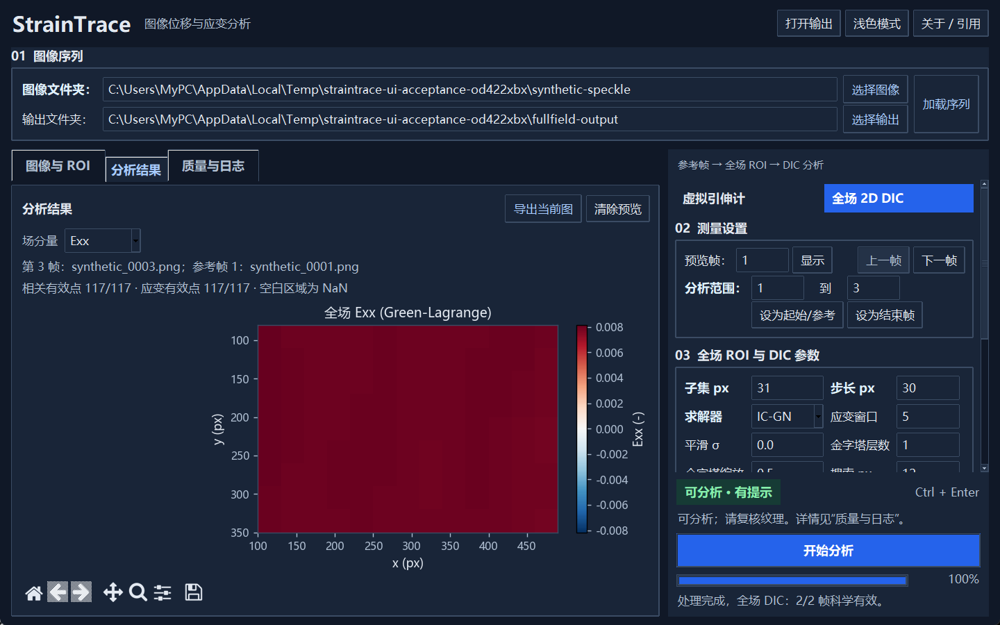

# 桌面工作区

StrainTrace 提供虚拟引伸计和固定参考帧全场 2D DIC 两种分析模式。新版界面沿用现有 Tk 桌面组件，将图像、结果和质量信息分别放入工作区；分析参数位于右侧，开始分析、进度和处理状态始终位于右下方。

本文截图使用合成散斑图像，展示软件交互和结果呈现。截图中的应变来自合成仿射变形，不代表实验精度或实验不确定度。

## 1. 加载图像并确定参考帧

在顶部选择图像文件夹和输出文件夹，点击“加载序列”。“图像与 ROI”显示当前文件名、帧号、图像尺寸和参考帧；右侧设置预览帧与分析范围。

点击“设为起始/参考”可将当前预览帧设为分析起点。全场模式中，后续变形帧始终与这个固定参考帧比较。更换图像序列后，应重新检查分析范围并定义 ROI。

“适应窗口”将图像完整显示在可用区域；“1:1”以原始像素比例显示。放大后的图像可通过水平、垂直滚动条查看。ROI 坐标始终对应原图像素，图像外的留白不接受 ROI 起点。

## 2. 定义测量区域

**虚拟引伸计：**选择应变方向与追踪模式，在参考帧绘制 ROI 1、ROI 2，点击“添加 ROI 组”。组表优先显示名称、角色、应变方向和初始标距；其他列可水平滚动查看。选中组后可载入、重命名、调整角色或删除。泊松比需要同时定义轴向和横向 ROI 组。

**全场 2D DIC：**选择全场模式，在参考帧绘制矩形 ROI，设置子集尺寸、步长、求解器和应变窗口。全场参数与虚拟引伸计参数独立；全场模式使用固定的 2D 导出内容。

常用参数默认可见；像素标定和详细追踪参数通过“高级设置”展开。窄窗口中，右侧参数区可以滚动，开始分析和处理状态保持可见。

## 3. 检查条件并开始分析

右下方显示当前是否具备分析条件，并提示下一步操作。缺少图像、ROI 或必要导出选项时，开始按钮禁用；有质量提示时，可在“质量与日志”查看具体原因。提示不等于分析失败，应根据其内容判断图像纹理与参数是否适用。

开始分析后，图像路径、模式和参数暂时禁用，避免界面设置与正在执行的分析不一致。进度条显示百分比；处理完成后恢复操作并切换到“分析结果”。发生错误时显示失败状态及原因，允许修正后重试。

## 4. 查看结果及质量

虚拟引伸计结果显示工程应变，满足角色条件时可切换泊松比。坐标轴明确帧号和无量纲应变；无效帧保持曲线断点，并使用单独标记表示。

全场结果可选择位移、应变或相关系数分量。位移以 px 表示，应变与相关系数无量纲。位移及应变使用以零为中心的发散色标，相关系数使用 0–1 连续色标。空白区域表示 `NaN`，未进行插值或补零。相关有效点和应变有效点分别计数；结果标题下方保留实际分析帧和参考帧的文件信息。

结果图支持平移、缩放、复位和导出，并随窗口尺寸调整。浅色与深色主题同时应用于坐标轴、图例、色标和工具栏。切换主题保留当前结果分量或曲线模式。

“质量与日志”包含分析前检查、质量概览和处理日志。全场概览给出有效变形帧数、各帧最低相关有效比例和应变有效比例，并列出失败帧。日志可选取、复制，内容只读。

## 快捷键

| 操作 | 快捷键 |
| --- | --- |
| 开始分析 | Ctrl + Enter |
| 适应窗口 | Ctrl + F |
| 放大 / 缩小图像 | Ctrl + 加号 / 减号 |
| 加载 / 刷新图像序列 | Ctrl + L |
| 清除当前 ROI（需确认） | Esc |

## 验证范围

本次界面优化在 Windows 原生 Tk 窗口中运行检查，覆盖两种模式的实际后台分析、结果导出与清单校验、ROI 坐标转换、处理状态、失败重试、主题切换及 1040 × 680 窄窗口。自动化检查覆盖 Tk 缩放系数 1.333、1.666 和 2.5，并检查坐标轴、色标与工具栏是否位于可见画布范围内。

界面检查使用合成图像；数值、导出事务和元数据契约由现有回归检查覆盖。运行检查不会把软件验证解释为实验测量准确度。版本和 DOI 元数据沿用当前项目记录。
